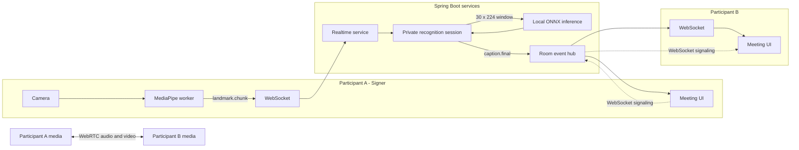
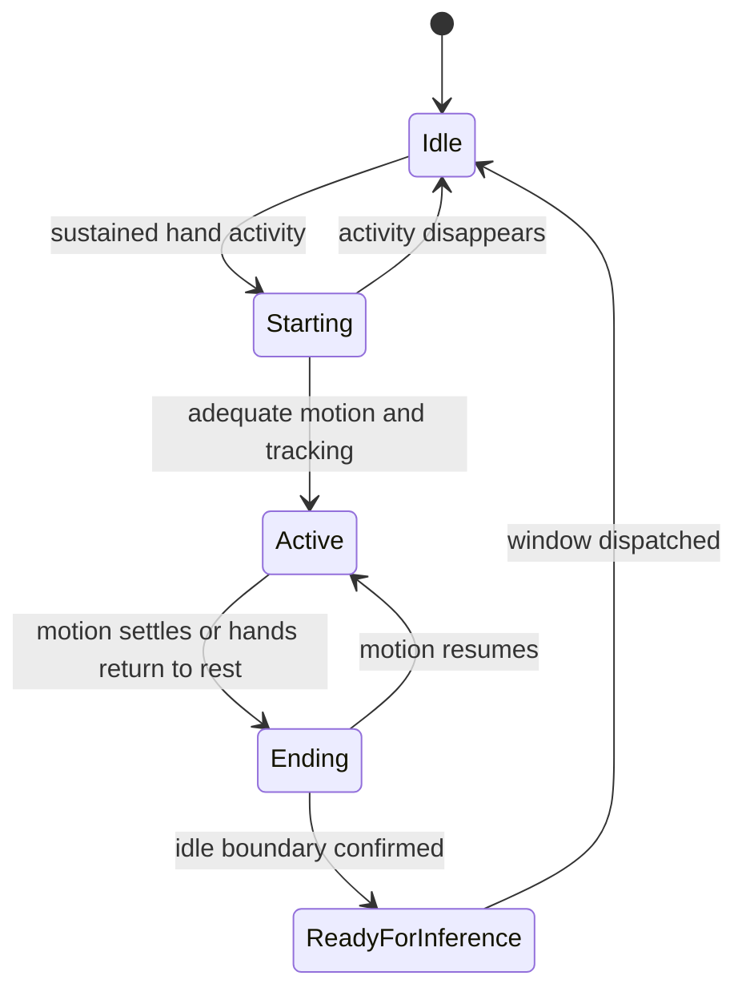

# SignConnect Product and Implementation Roadmap

> Status: Active
> Last updated: 2026-09-01
> Product focus: Accessible two-person meetings between a signer and a participant who reads captions
> Inference strategy: Local MediaPipe capture with Spring Boot and ONNX Runtime Java

## Purpose

This document turns the current SignConnect prototype into an accessible conversation product. There is no standalone recognition destination; recognition controls exist only where they support the live meeting. Each milestone must improve the two-person meeting loop and has a clear objective, implementation scope, acceptance gate, and explicit exclusions.

The immediate product goal is:

> A signer and a participant who does not understand the sign language join from separate devices, see each other, and use readable shared captions to complete a short exchange.

The next major demonstration is deliberately narrower than a claim of full translation:

> Two people complete a one-to-one WebRTC call while a genuine, explicitly supported sign performed by one participant appears as a source-attributed caption on the other participant's screen.

## Product capability amendment — 2026-09-01

### Capability

SignConnect enables a private two-person meeting in which one participant communicates visually through sign and the other follows the signed contribution through readable, source-attributed captions. The meeting is the only primary product surface. Recognition exists inside that meeting to serve the conversation and must fail without taking the call down.

### Fixed constraints

- The first meeting has exactly two participants and one active signer at a time.
- Both participants receive the same finalized transcript events, but raw video, landmarks, recognition status, and unknown-result feedback retain their existing privacy boundaries.
- Raw recognition input is never silently retained or reused for training.
- The meeting remains usable when recognition is unavailable, uncertain, or reconnecting.
- Captions must identify the source participant and whether the text is a signed, spoken, or typed contribution once those input modes exist.
- Capability claims must match evidence. An isolated-sign vocabulary is **supported-sign recognition**, not continuous sign-language transcription.
- SgSL remains the intended production language unless product leadership explicitly selects a different sign language. ASL research assets remain non-production and must be labelled as such.
- Interface work reuses `DESIGN.md` and `frontend/styles/system.css`; material meeting changes require running-desktop validation.

### Actors and primary surfaces

| Actor | Primary need | Primary surface |
|---|---|---|
| Signer | Be visible, know when recognition is ready, and know whether a contribution was understood | Remote participant video, compact local preview, recognition guidance, transcript confirmation |
| Caption reader | Follow the signer's meaning without knowing the sign language | Remote signer video and a large, readable live-caption/transcript region |
| Either participant | Join, control media, recover from failures, and leave safely | Invitation flow, call controls, connection state, transcript, privacy details |
| Reviewer/operator | Validate model provenance and quality without turning diagnostics into the meeting experience | Development-only evaluation tooling that is not linked from the user-facing app |

### Conversation states

```text
invited -> joining -> device check -> ready -> connecting -> in meeting
in meeting -> signing -> processing -> caption finalized | not understood
in meeting -> reconnecting -> recovered | ended
in meeting -> recognition degraded (call remains active)
```

### Interface and data implications

- Treat `caption.final` as one contribution type in a meeting transcript rather than the purpose of the room.
- Preserve a stable `captionId`, room ordering, source participant, language/model provenance, and final/unknown distinction.
- Add versioned, room-scoped WebRTC signaling; route it only to the intended participant.
- Reuse one local camera stream for WebRTC and MediaPipe so the signer is not prompted twice and devices are released together.
- Keep partial/unstable model output local until a later continuous-transcription contract explicitly defines revision semantics. The current meeting may derive a visibly provisional sentence from already-finalized supported-sign captions, but that is presentation logic rather than model-level continuous transcription.
- Future signed, spoken, and typed contributions need a common transcript-entry contract or a versioned compatibility layer; this requires architecture review before implementation.

### Non-goals for the first meeting release

- Claiming open-ended or sentence-level sign-language translation from the current isolated-sign model.
- Multi-party conferencing, simultaneous signers, recording, automatic training from meetings, or server-side media processing.
- Replacing video with captions; the signer remains visually present because signing includes information the current model may not capture.

### Open product decisions

- Confirm SgSL as the first production language and engage compensated SgSL-fluent Deaf co-design/review.
- Decide whether the non-signing participant replies primarily by speech, typed messages, or both. The roadmap assumes ordinary call audio plus typed fallback.
- Decide whether transcripts are ephemeral by default (recommended) and whether either participant may opt in to saving them.
- Define the user-research threshold for calling the product useful for a conversation rather than merely a technical demonstration.
- Continuous transcription requires separate architecture, data, linguistic, consent, and evaluation approval; it is now a core research track rather than an unspecified future feature.

## How to use this roadmap

Use the milestone dependencies as the delivery order. Milestone 4 is implemented in the browser and awaits only separate-device acceptance; Milestone 5 governance/data and Milestone 6 genuine continuous-SgSL research are now the critical path. A milestone is complete only when its acceptance gate passes.

For each milestone:

1. Create the recommended branch from an up-to-date `main`.
2. Confirm the prerequisite milestones are complete.
3. Implement only the in-scope work.
4. Run the focused automated checks and manual demonstration.
5. Record important decisions in the implementation notes.
6. Merge only after the acceptance gate passes.

Progress legend:

- `[ ]` Not started
- `[-]` In progress
- `[x]` Complete

## Current baseline

SignConnect already contains a meaningful recognition pipeline and room foundation:

- MediaPipe hand and upper-body landmark extraction runs in a browser worker.
- Capture targets approximately 25 processed frames per second.
- A completed browser-local gesture is resampled to 30 frames and sent as six ordered five-frame `landmark.chunk` messages.
- The browser serializes completed gestures because v1 results identify only the stream. The realtime service assembles one `[1, 30, 224]` candidate per dispatched gesture; at most one inference is in flight and latest-pending replacement remains a defensive fallback for legacy or non-browser clients. Rolling windows remain an explicit legacy mode only.
- Spring Boot calls the inference service over HTTP.
- ONNX Runtime Java executes the configured model locally.
- The realtime service returns immediate final/unknown decisions in default segmented mode and handles occurrence separation, backpressure, timeouts, and reconnect resets; temporal voting, idle finalization, cooldown, and duplicate suppression belong to explicit legacy rolling mode.
- The meeting frontend owns a single reconnecting WebSocket client per meeting.

The three important product limitations are:

1. The current ONNX model is intentionally synthetic and cannot be presented as validated sign-language recognition.
2. Room sharing is deliberately limited to finalized captions; landmark input, recognition status, and unknown-sign feedback remain private to the submitting signer.
3. The meeting now provides one-to-one WebRTC media, typed replies, and shared sentence presentation, but the signed sentence is assembled from isolated supported-sign captions. It does not yet understand continuous SgSL grammar or non-manual linguistic features.

Relevant implementation references:

- [`docs/adr/0001-mock-first-sign-recognition.md`](adr/0001-mock-first-sign-recognition.md)
- [`docs/privacy/sign-recognition-data-boundary.md`](privacy/sign-recognition-data-boundary.md)
- `backend/realtime-service`
- `backend/sign-inference-service`
- `backend/meeting-service`
- `frontend/apps/meeting/src/recognition`
- `config/vocabulary/sign-v1-candidates.json`

## Product scope

### First real product slice

- Desktop-first experience.
- One host and one guest.
- One active signer at a time.
- Ephemeral meeting rooms.
- A one-to-one audio/video call with typed replies and shared signed-sentence presentation.
- A caption-reader-first meeting layout, while retaining clear signer feedback.
- Small, explicitly supported isolated-sign vocabulary.
- Local landmark extraction.
- Local ONNX inference service.
- Recognition degradation that never terminates the call.

### Not the initial product scope

- Production claims of continuous sentence translation before the continuous-transcription research gate passes.
- Large or open-ended vocabulary.
- Multiple simultaneous signers.
- Multi-party video conferencing.
- Automatic learning from user corrections.
- Storing raw camera recordings.
- Mobile-specific layouts.
- Kubernetes or premature distributed infrastructure.

## Privacy boundary

Camera pixels stay in the browser recognition pipeline. Derived landmark data is sent only to the signer's private recognition session and is handled transiently. It is not persisted, logged, or broadcast to other room participants. Only finalized captions, participant state, and call-signaling events are shared through the room event layer. WebRTC carries encrypted peer media separately from the recognition service.

## Target user experience

1. The host creates a SignConnect room.
2. SignConnect generates a shareable link and short join code.
3. A guest opens the link and enters a display name.
4. Both participants see the room and participant presence.
5. The signer enables their camera and recognition.
6. SignConnect reports whether the upper body and hands are adequately tracked.
7. The signer performs one or more supported signs as a short contribution.
8. The browser extracts and normalizes landmarks for each isolated sign.
9. The realtime and inference services classify each completed sign and return a final caption or private unknown feedback; explicit legacy rolling mode adds temporal stabilization.
10. Both participants deterministically compose the same ordered captions into one visibly provisional sentence and finalize it after a 2.5-second pause, signer/stream change, recognition stop, or 12-part safety limit.
11. Both participants see each other throughout the exchange and can use call audio or typed fallback for the non-signing participant's reply.
12. If recognition is unavailable or uncertain, the signer receives private guidance while the meeting and video remain active.

## Target architecture



## Milestone summary

| Milestone | Outcome | Recommended branch | Depends on |
|---|---|---|---|
| 1. Realtime room foundation | Two browsers share presence and finalized captions | `codex/realtime-room-mvp` | Current baseline |
| 2. Reliable room behavior | Reconnect, ordering, isolation, and active-signer ownership | Continue Milestone 1 branch or `codex/realtime-room-reliability` | Milestone 1 |
| 3. Gesture capture and segmentation | Clear camera guidance and cleaner gesture windows | `codex/milestone-3-live-sign-recognition` | Milestone 2 |
| 4. Accessible one-to-one meeting MVP | Two devices see/hear each other and captions serve the live conversation | `codex/accessible-meeting-mvp` | Milestones 2-3 |
| 5. Trustworthy supported-sign pilot | Reviewed, signer-independent limited SgSL vocabulary supports a structured exchange | `codex/sgsl-supported-sign-pilot` | Milestones 3-4 plus external governance inputs |
| 6. Continuous SgSL transcription alpha | Sentence-level signed contributions become revisable then finalized captions | `codex/continuous-sgsl-alpha` | Milestones 4-5 plus architecture and research approval |
| 7. Deployable private meeting beta | Secure, resilient, observable cross-network meeting product | `codex/private-meeting-beta` | Milestones 4-6 |

Milestone 4's browser implementation is now complete and its automated two-browser acceptance path passes. Separate physical-device acceptance remains open. Model qualification and genuine continuous-SgSL research are now the product critical path; the implemented sentence composer must not be misrepresented as validated SgSL transcription.

---

# Milestone 1: Realtime room foundation

## Status

- [x] Complete

## Objective

Convert the current same-client WebSocket path into a room-based system where multiple participants can join a meeting and receive the same public events while recognition input remains private to the submitting connection.

## User outcome

The host creates a room, a guest joins it, both see participant presence, and both receive one identical finalized caption when the host-side recognition fixture completes.

## Backend scope

### Room registry

Introduce a room registry interface in the realtime service.

The first implementation should be in memory:

```text
meetingId
  +-- participant A connection
  +-- participant B connection
  +-- participant C connection
```

Each connection continues to own a private `RealtimeRecognitionSession`. The registry is responsible for public room membership and outbound public events, not inference state.

Suggested responsibilities:

- Register an authenticated connection.
- Remove a disconnected connection.
- Return a room membership snapshot.
- Broadcast allowed public events.
- Prevent cross-room delivery.
- Enforce a small room capacity.
- Track the active signer.

Suggested types:

- `RoomRegistry`
- `InMemoryRoomRegistry`
- `RoomConnection`
- `RoomParticipant`
- `RoomSnapshot`
- `RoomEventPublisher`

### Public and private event separation

Private connection input:

```text
landmark.chunk -> recognition session -> inference
```

Public room output:

```text
caption.final -> all room participants
participant.joined -> all room participants
participant.left -> all room participants
```

`recognition.unknown` should initially return only to the signer because it is interaction feedback rather than transcript content.

## Meeting service scope

The current meeting service creates meetings but does not provide a participant lifecycle. Add the smallest useful lifecycle:

```text
POST /api/v1/meetings
POST /api/v1/meetings/{joinCode}/participants
GET  /api/v1/meetings/{meetingId}
POST /api/v1/meetings/{meetingId}/leave
```

The participant join response should contain:

- `meetingId`
- `participantId`
- `displayName`
- `role`
- `realtimeTicket`
- `expiresAt`

For the first implementation, meetings and participant tickets can be ephemeral and in memory.

## WebSocket contract

Recommended client events:

- `room.join`
- `room.leave`
- `participant.heartbeat`
- Existing `recognition.control`
- Existing `landmark.chunk`

Recommended server events:

- `room.joined`
- `room.snapshot`
- `participant.joined`
- `participant.left`
- `participant.updated`
- Existing `caption.final`
- Existing `recognition.unknown`
- Existing recognition status events

The connection should remain untrusted until a valid `room.join` message supplies the short-lived realtime ticket. Reject other application messages until joining succeeds.

Recommended shared event envelope:

```json
{
  "schemaVersion": 1,
  "type": "caption.final",
  "meetingId": "meeting-id",
  "participantId": "source-participant-id",
  "sequence": 42,
  "occurredAt": "2026-08-29T12:00:00Z",
  "payload": {}
}
```

Add the following caption fields:

- `captionId`
- `sourceParticipantId`
- `sourceDisplayName`
- `streamId`
- `labelId`
- `text`
- `confidence`
- `modelVersion`
- `mockModel`
- `inferenceLatencyMs`

Use `captionId` as the stable idempotency key across reconnects.

## Frontend scope

- Create-room screen.
- Join-room screen.
- Display-name entry.
- Copyable invitation link.
- Short join-code display.
- Participant list.
- Connection status.
- Active-signer indicator.
- Caption source name.
- Clear failure state for invalid or expired rooms.

The first proof can use two browser windows. It does not require user accounts, persistence, or WebRTC.

## Implementation checklist

- [x] Define versioned room event types in frontend and backend.
- [x] Create meeting participant and realtime-ticket models.
- [x] Add the meeting join endpoint.
- [x] Add the room registry interface.
- [x] Implement the in-memory room registry.
- [x] Authenticate the initial `room.join` event.
- [x] Create and broadcast room snapshots.
- [x] Broadcast participant join and leave events.
- [x] Attach source participant metadata to `caption.final`.
- [x] Broadcast finalized captions to the room.
- [x] Keep unknown recognition feedback private to the signer.
- [x] Add create/join frontend routes or views.
- [x] Add the invitation and participant UI.
- [x] Demonstrate with two browser windows.

## Acceptance gate

- [x] Two browser windows can join the same meeting.
- [x] Both receive participant presence updates.
- [x] A fixture or recognized sign from participant A creates one caption.
- [x] The caption appears exactly once in both browsers.
- [x] Participant B never receives A's landmark chunks.
- [x] Another meeting cannot receive the caption.
- [x] Disconnecting a browser removes its presence.
- [x] The current synthetic model remains clearly identified as a demo model.

## Explicitly out of scope

- WebRTC audio or video.
- Redis.
- Database persistence.
- User accounts.
- Multiple active signers.
- Caption history replay.

---

# Milestone 2: Reliable room behavior

## Status

- [x] Implementation complete
- [x] Acceptance verified on 2026-08-30

Compatibility note: this atomic Milestone 2 change is the final intentional pre-release reset of `realtime-room` v1 because Milestone 1 was not externally released; after Milestone 2, strict field changes require v2 or explicit version negotiation.

## Objective

Make the two-browser room demonstration deterministic under reconnects, message duplication, failures, and participant changes.

## Room ordering

Use two independent ordering concepts:

- A private stream sequence for signer landmark and inference ordering.
- A public room sequence for room events and captions.

Recommended caption idempotency components:

```text
meetingId + sourceParticipantId + streamId + captionSequence
```

The client transcript should ignore a caption whose `captionId` is already present.

## Active signer ownership

Support one active signer at a time.

Suggested behavior:

1. A participant enables recognition.
2. The server grants or denies the active-signer role.
3. Other participants can still use their camera for the call later, but cannot upload recognition landmarks.
4. The role is released when recognition stops, the signer leaves, or the connection expires.

Recommended events:

- `signer.request`
- `signer.granted`
- `signer.denied`
- `signer.released`
- `participant.updated`

## Reconnect behavior

- Preserve the participant identity with a short-lived resume token.
- Rotate the resume token atomically after use and reject replay of the consumed token.
- Immediately close and invalidate the replaced connection and its recognition session.
- Generate a new recognition `streamId` after reconnect.
- Reset the private recognition window and stabilizer.
- Discard late inference results from the old connection.
- Return a fresh room snapshot.
- Do not replay old captions in this milestone.
- Do not duplicate an already-rendered caption.

## Backpressure classes

Treat event categories differently:

- Completed landmark candidates: the browser waits for the current stream-only result before another dispatch; the server still permits one inference in flight and may replace older pending work from a legacy/non-browser client without mixing gesture frames.
- Control and signer-ownership events: ordered and never silently dropped.
- Final captions: ordered, idempotent, and never replaced by a newer caption.
- Presence: snapshots may supersede older transient presence updates.

## Failure states

The frontend should distinguish:

- Room disconnected.
- Reconnecting.
- Room no longer exists.
- Realtime ticket expired.
- Signer role unavailable.
- Recognition service unavailable.
- Inference timed out.
- Camera tracking lost.

## Focused automated checks

1. A final caption reaches both participants exactly once.
2. A caption never leaks into another meeting.
3. Landmark chunks are never broadcast to another participant.
4. Disconnecting removes the participant and private recognition session.
5. Reconnect cannot finalize a stale inference response.

## Implementation checklist

- [x] Add room event sequence numbers.
- [x] Add stable caption identifiers.
- [x] Make transcript insertion idempotent.
- [x] Add active-signer ownership.
- [x] Add resume-ticket behavior.
- [x] Reset recognition streams on reconnect.
- [x] Discard stale inference responses.
- [x] Add room and recognition failure states.
- [x] Add the five focused integration checks.
- [x] Run a two-browser disconnect and reconnect demonstration.

## Acceptance gate

- [x] Two participants maintain a consistent ordered transcript.
- [x] Reconnect does not duplicate the last caption.
- [x] Old inference work cannot appear after reconnect.
- [x] Only the granted signer can upload landmark chunks.
- [x] Cross-room isolation checks pass.
- [x] Recognition failure does not terminate the meeting room.

The automated acceptance scenarios are implemented in the backend WebSocket and Playwright suites. On 2026-08-30, the full repository verifier and all 14 bundled-Chromium acceptance scenarios passed. The managed Windows host requires a short `TEMP`/`TMP` path for Java NIO selector tests; verification used `C:\jtmp` without changing application behavior.

## Camera presentation enhancement

- [x] Keep the camera preview in a responsive 4:3 stage instead of a shallow horizontal crop.
- [x] Use `object-fit: contain` and center the video so the signer can see their full captured frame.
- [x] Keep the tracking canvas aligned with the displayed video.
- [x] Move controls below the stable camera stage.
- [x] Remove horizontal page overflow at 720 px and 320 px viewport widths.
- [x] Validate the material interface in the running web app with a local canvas-backed camera stream.

---

# Milestone 3: Gesture capture and segmentation

Concrete completion and multilingual model-integration plan: [`milestone-3-multilingual-recognition-execution-plan.md`](milestone-3-multilingual-recognition-execution-plan.md).

## Status

- [x] Complete for the isolated-sign engineering workflow — real MediaPipe tracking, bounded segmentation, and an official ASL Hello virtual-webcam journey reach a final model caption; broader devices/signers remain a validation expansion

## Objective

Make camera recognition understandable to the user and produce cleaner temporal samples for a real model.

## Tracking feedback

Support clear camera states:

- Camera off.
- Camera initializing.
- No person detected.
- Upper body not fully visible.
- Left hand missing.
- Right hand missing.
- Hands too close to the frame edge.
- Lighting or tracking quality too poor.
- Ready to sign.
- Gesture in progress.
- Processing.
- Sign recognized.
- Sign not recognized.

## Optional tracking overlay

Add a toggleable overlay with:

- Left and right hand skeletons.
- Upper-body anchor points.
- Safe signing area.
- Frame-edge warnings.
- Gesture activity indicator.

The overlay should help with setup but remain optional during a conversation.

## Session calibration

After camera startup:

1. Ask the user to sit or stand naturally.
2. Confirm both shoulders are visible for calibration; require at least one signing hand only when capture begins, and both hands only for vocabulary entries that need them.
3. Measure approximate shoulder scale.
4. Hold the ready setup for eight stable quality frames; preview mirroring remains presentation-only.
5. Keep calibration data only for the active session.

## Gesture boundary state machine



Potential segmentation signals:

- Hand and wrist velocity.
- Finger landmark movement.
- Distance between hands.
- Pose stability.
- Visible-landmark count.
- Consecutive idle frames.
- Frame timestamps and dropped-frame gaps.

The inference tensor can remain `[1, 30, 224]`. Crop, resample, or pad the detected gesture interval into 30 frames.

## Handedness and fixture coverage

Preserve the existing MediaPipe handedness correction and validate it with recorded landmark fixtures covering:

- Left-handed signing.
- Right-handed signing.
- Mirrored preview.
- One-hand signs.
- Two-hand signs.
- Temporary occlusion.
- Different camera distances.
- Faster and slower performance.

## Implementation checklist

- [x] Define the camera-quality model.
- [x] Calculate frame-edge and visibility quality.
- [x] Add the optional landmark overlay.
- [x] Add the signing-area guide.
- [x] Add session calibration.
- [x] Implement local activity detection.
- [x] Implement gesture start/end hysteresis.
- [x] Capture a stationary held sign once, with bounded pre-roll and brief tracking/camera-cadence grace.
- [x] Bound continuous motion by both source-frame count and a 3.6-second wall-clock limit so noisy movement cannot remain `Gesture in progress` forever.
- [x] Resample bounded gestures into the model input window.
- [x] Preserve missing-landmark masks.
- [x] Create deterministic normalized landmark fixtures for segmentation and browser validation. These are synthetic fixtures, not SgSL recordings or accuracy evidence.
- [x] Add actionable unknown-sign feedback.
- [x] Keep an in-flight gesture in `Processing` and fail it closed after a five-second terminal-response watchdog, with a clear retry message and no transcript caption.
- [x] Show transcript captions with signer attribution, second-level local time, confidence, and real-versus-mock provenance; avoid the redundant `You (you)` label and expose semantic `<time datetime>` metadata.
- [x] Increase camera guidance, recognition state, controls, transcript metadata, and health text to readable interface sizes.
- [x] Calibrate from stable shoulders before hands are raised, accept a hand near (but not clipped by) the guide, and complete an active gesture when the hand naturally leaves the guide.

## Acceptance gate

- [x] The interface explains why recognition is unavailable.
- [x] Users can position themselves without guessing; fixture-backed coverage, a Windows camera check, and an official signing clip through a virtual webcam exercise the readiness guidance.
- [x] Camera/body adjustment is compensated and regression-tested; calibration no longer waits for raised hands and natural hand release dispatches the captured gesture.
- [x] Held signs do not repeatedly emit captions.
- [x] Returning to idle separates genuine repeated signs.
- [x] Deterministic fixtures normalize consistently across distance, frame rate, missing-point masks, and dropped-frame gaps.
- [x] Automated coverage proves a visible hand stays reported even when missing shoulders keep recognition unavailable.

---

# Milestone 4: Accessible one-to-one meeting MVP

## Status

- [x] Browser implementation complete
- [-] Separate physical-device acceptance remains open

## Objective

Turn the existing room and recognition capabilities into the intended product: a two-person meeting where participants see and hear one another and the caption reader can follow a signed contribution on their own screen.

## User outcome

A host shares an invitation, a guest joins from another browser or device, and the call connects. The signer enables recognition without reopening the camera, performs a short sequence of explicitly supported signs, and both participants receive one readable signed sentence while video and typed reply paths stay active.

## Meeting experience

- Make the remote participant and conversation transcript the primary flexible regions.
- Keep the signer's local preview visible but subordinate to the remote participant except during setup.
- Give the caption reader a large live-caption treatment plus transcript history; do not expose model diagnostics as a product destination.
- Keep tracking/calibration guidance near the signer's local preview and private to the signer.
- Show signed captions with source name, timestamp, language/model provenance, and an honest experimental label.
- Add typed participant messages as the accessible fallback and response path assumed by this milestone; distinguish `signed` and `typed` entries semantically and visually.
- Preserve transcript reading position when new entries arrive and provide the existing text-labelled jump-to-latest behavior.
- Reuse the design system's transcript, participant identity, device-select, button, focus, contrast, and live-region rules.

## Technology responsibilities

| Technology | Responsibility |
|---|---|
| WebSocket | Presence, room events, captions, and call signaling |
| WebRTC | Audio and video media |
| HTTP | Meeting creation, participant joining, and model inference |
| MediaPipe | Browser-local landmark extraction |

## Signaling events

Add room-scoped events:

- `call.offer`
- `call.answer`
- `call.ice-candidate`
- `call.decline`
- `call.leave`
- `media.state`

Signaling payloads must be routed only to the intended participant in the same meeting.

## Media behavior

- Reuse the existing local camera `MediaStream` for recognition.
- Do not request or open the same camera twice.
- Provide camera on/off.
- Provide microphone mute/unmute.
- Provide audio and video device selection.
- Show the local preview.
- Show the remote participant video.
- Show call connection and recovery states.
- Handle permission denial clearly.
- Stop media tracks when leaving.
- Do not stop or obscure the call when recognition is unavailable.
- Keep remote video visible while captions update; captions supplement rather than replace signed video.

## Transcript contract decision

Before adding typed entries, perform an architecture review and either version `caption.final` into a general transcript-entry contract or introduce a compatible event beside it. The contract must carry:

- stable entry ID and room sequence;
- source participant ID and display name;
- contribution kind (`signed` or `typed` in this milestone);
- finalized text and occurrence time;
- language/model provenance for recognized signs;
- edit/revision semantics fixed to immutable finalized entries for this milestone.

## Network infrastructure

A local proof can begin with STUN. A deployed application requires TURN for networks where direct peer connectivity fails.

Keep the first version one-to-one and peer-to-peer. If multi-party meetings become necessary, evaluate an SFU such as LiveKit, mediasoup, or Janus rather than building a browser mesh.

## Implementation checklist

- [x] Define versioned call-signaling events.
- [x] Route signaling to the intended room participant.
- [x] Create the peer-connection lifecycle.
- [x] Exchange offers, answers, and ICE candidates.
- [x] Reuse the recognition camera stream.
- [x] Add local and remote video surfaces.
- [x] Add microphone and camera controls.
- [x] Add device selection.
- [x] Add call failure and reconnect states.
- [x] Define compatible immutable signed-caption and typed-message events rendered in one transcript.
- [x] Add a bounded typed-message composer and shared typed entries.
- [x] Compose consecutive same-signer, same-stream finalized sign captions into one provisional sentence and finalize on pause, stop, source change, or length limit.
- [x] Remove the standalone recognition navigation and presentation; retain only meeting-embedded recognition controls and development-only evaluation tooling.
- [x] Implement the caption-reader-first meeting layout using existing design-system primitives.
- [x] Verify recognition degradation leaves media and typed communication available.
- [x] Configure STUN for development.
- [ ] Test on two separate devices.
- [x] Validate the material interface in the running desktop app with keyboard, reduced-motion, and a 720-CSS-pixel effective viewport equivalent to a 1440-pixel desktop at 200% zoom.

## Acceptance gate

- [-] Two isolated browsers join through the same invitation link; repeat on two separate physical devices.
- [x] Both participants establish explicitly accepted peer media and receive live remote video tracks in automated Chromium.
- [x] The signer's camera simultaneously feeds the call and MediaPipe capture path.
- [x] Recognized supported-sign fragments appear as one completed sentence for both participants.
- [x] The caption reader can identify who signed, what finalized sentence was composed, and whether the system is experimental.
- [x] Either participant can send a typed fallback entry and both see it in the same ordered transcript.
- [x] Camera and microphone state remains synchronized.
- [x] Leaving releases media devices.
- [x] Recognition failure leaves the call and typed fallback usable.
- [x] Two isolated browsers complete an automated call/sign/help/typed-reply exchange entirely within the meeting room.

## Explicitly out of scope

- Group calling.
- Screen sharing.
- Recording.
- Server-side media processing.
- Background effects.
- TURN-backed staging readiness; this is required by Milestone 7.
- Claims that the research ASL model or synthetic fixture provides SgSL transcription.

---

# Milestone 5: Trustworthy supported-sign pilot

## Status

- [-] Engineering pipeline exists; genuine SgSL work is externally blocked by governance, review, and approved data

## Objective

Provide a small, reviewed, signer-independent SgSL vocabulary that supports a structured meeting exchange. This milestone merges the former real-model and qualified-vocabulary milestones and evaluates the model inside the meeting rather than in an isolated recognition screen.

## Product language

Describe this capability as **supported-sign recognition**. Do not describe it as continuous SgSL transcription or full translation.

## Scope and evidence

- Begin with five reviewed, visually distinguishable meeting intents, then expand only if quality remains credible.
- Candidate intents include hello, yes, no, help, repeat, slower, understand, finished, thank you, and goodbye; an SgSL-fluent Deaf reviewer decides the actual signs, variants, and caption wording.
- Collect explicit `NO_SIGN`, unsupported-sign, idle, and transition examples.
- Target at least ten diverse signers before a product pilot; all train, validation, and locked test partitions are separated by signer.
- Compare the existing small TCN and GRU pipelines and keep the simpler model unless evidence supports a different architecture.
- Export a checksummed ONNX artifact, verify Python/ONNX parity, and fail closed when the approved model is absent.

## Existing engineering assets

- [x] Strict dataset manifest and signer-disjoint split contracts.
- [x] Reproducible TCN/GRU training, evaluation, export, parity, and Java model-validation paths.
- [x] Explicit mock/real configuration with no silent fallback.
- [x] A ten-concept ASL research pack traverses the full meeting pipeline and remains clearly non-production.
- [-] Disabled-by-default offline capture workflow enforces separate collection consent, retention, deletion, reviewer, and governance inputs.

These assets reduce engineering risk but are not evidence of SgSL quality, linguistic correctness, consent, or product usefulness.

## Quality and conversation evaluation

Measure per-class precision/recall/F1, macro F1, confusion matrix, idle false-positive rate, unsupported-sign rejection, inference latency, end-to-end caption latency, and performance slices across signers and capture conditions.

Initial candidate gates:

- signer-independent macro F1 at or above 0.80;
- no supported sign with catastrophically low recall;
- very low false positives during natural conversation movement;
- ONNX inference comfortably below 500 ms;
- caption finalization approximately 1 to 1.5 seconds after the isolated sign finishes;
- caption readers correctly understand at least 90% of recognized contributions in the scripted pilot without model assistance from a facilitator.

If the model misses a gate, reduce or revise the vocabulary rather than hiding uncertainty or expanding labels.

## Implementation checklist

- [ ] Confirm language, vocabulary, variants, prompts, and caption wording with a compensated SgSL-fluent Deaf reviewer.
- [ ] Approve consent, data governance, retention, deletion, and trained-weight use.
- [ ] Collect diverse signer, environment, `NO_SIGN`, unsupported-sign, idle, and transition samples.
- [ ] Freeze a signer-independent final test set.
- [ ] Generate per-class, robustness, rejection, and latency reports.
- [ ] Tune segmentation, thresholds, and confusing vocabulary items without touching the locked test set.
- [ ] Add reviewed reference demonstrations and supported-vocabulary help inside meeting setup.
- [ ] Run a two-participant structured meeting pilot with unseen signers and caption readers.
- [ ] Record qualitative failures, repair attempts, and whether typed fallback restored the exchange.

## Acceptance gate

- [ ] Governance and SgSL-fluent Deaf review gates pass.
- [ ] The agreed signer-independent and rejection-quality gates pass.
- [ ] Final captions remain stable, ordered, and correctly attributed in the active call.
- [ ] Unknown signs produce useful private signer feedback without inventing transcript text.
- [ ] Held signs do not repeat; a genuine repeat after idle is recognized.
- [ ] Caption readers complete the defined structured exchange at the agreed comprehension threshold.
- [ ] Model failure does not break video, audio, or typed communication.

---

# Milestone 6: Continuous SgSL transcription alpha

## Status

- [-] Presentation-level sentence bridge implemented; genuine continuous-SgSL research and architecture approval still required

## Objective

Advance from isolated supported signs to the project's actual long-term communication capability: bounded continuous SgSL contributions that appear as revisable text and settle into finalized transcript entries during a live two-person meeting.

This is not a routine extension of Milestone 5. It changes capture, model, event, transcript, privacy, and evaluation contracts and must begin with a written architecture/research decision.

## Implemented bridge — 2026-09-01

The meeting client now groups ordered, immutable `caption.final` events from the same participant and recognition stream into one sentence card. The card is visibly provisional while signs continue and becomes final after a 2.5-second pause, recognition stop, source/stream change, or 12-part safety limit. Duplicate caption IDs are ignored, confidence and model provenance are retained across parts, and both room participants derive the same sentence from the same public caption events.

This bridge removes the one-card-per-word experience for the current supported-sign pipeline. It does **not** recognize a continuous SgSL sentence, infer SgSL grammar, translate gloss order, use facial/non-manual features, or revise model output. Those capabilities remain in the unchecked work below.

## Required discovery and co-design

- Define the first supported conversation domain with SgSL-fluent Deaf participants; do not target open-domain translation in the alpha.
- Decide whether the intermediate representation is direct text, gloss sequences plus translation, or another linguistically reviewed representation.
- Determine required non-manual features such as facial expression, head movement, mouthing, and body posture; update the privacy disclosure before collecting or transmitting new features.
- Establish consented continuous SgSL data with sentence/contribution boundaries, translations, signer IDs, variants, and rights suitable for the intended use.
- Define evaluation with Deaf signers and caption readers, including semantic adequacy and harmful-mistranslation review—not word accuracy alone.

## Contract and system changes

- Introduce a versioned continuous-capture/model contract rather than forcing sentence input into `[1,30,224]` isolated windows.
- Support contribution lifecycle events such as `transcript.partial`, `transcript.revised`, `transcript.final`, and private `transcript.uncertain` with stable contribution and revision IDs.
- Make partial text visibly provisional, announce changes accessibly without live-region flooding, and place only finalized text in transcript history.
- Define cancellation, reconnect, stale-revision rejection, backpressure, and finalization rules.
- Keep raw video browser-local unless a separately approved architecture and consent decision explicitly changes that invariant.

## Alpha scope

- One active signer in a two-person call.
- One reviewed, bounded meeting domain.
- Short signed contributions with pauses, not unrestricted conversation.
- Ephemeral transcripts by default.
- Typed fallback remains available throughout.

## Implementation checklist

- [ ] Approve a continuous-transcription ADR covering representation, capture, privacy, event revisions, latency, and failure semantics.
- [ ] Complete Deaf-led domain, language, and caption-wording co-design.
- [ ] Obtain approved, licensed, consented continuous SgSL data and a locked signer-independent evaluation protocol.
- [ ] Version browser capture and inference contracts for continuous sequences and required non-manual features.
- [ ] Implement provisional/revised/final transcript events with ordering and stale-revision tests.
- [x] Add a bounded client-side sentence presentation bridge for ordered isolated-sign captions, with pause/source/stop/length finalization and duplicate protection.
- [ ] Build and compare appropriate temporal recognition/translation baselines.
- [ ] Validate semantic adequacy, unknown handling, latency, and signer-independent performance.
- [ ] Run observed two-person alpha sessions and document communication repairs and harmful errors.

## Acceptance gate

- [ ] Deaf reviewers approve the bounded domain, prompts, reference translations, and release claim.
- [ ] Unseen signers complete bounded signed contributions without reverting to isolated-sign prompts.
- [ ] Caption readers recover the intended meaning at the pre-agreed semantic threshold.
- [ ] Provisional captions never masquerade as final and stale revisions cannot overwrite newer text.
- [ ] Uncertain or out-of-domain signing fails honestly and leaves call/typed fallback usable.
- [ ] Privacy, latency, fairness slices, and harmful-error gates pass for the alpha population.

---

# Milestone 7: Deployable private meeting beta

## Status

- [ ] Not started

## Objective

Move the working two-person conversation slice into a secure, resilient, observable staging application that works across ordinary networks.

## Identity and authorization

- User accounts or durable guest identities.
- Host, signer, and viewer roles.
- Expiring invitation links.
- Short-lived realtime tickets.
- Authorized meeting access.
- Room capacity limits.
- Request and event rate limits.
- Restricted WebSocket origins.

## Persistence

Use a relational database for:

- Meetings.
- Participants.
- Meeting lifecycle.
- Invitations.
- Model versions.
- Optional caption transcript metadata.

Caption persistence should be opt-in and governed by an explicit retention policy.

## Realtime scaling

Keep room membership behind the `RoomRegistry` interface from Milestone 1.

Start with:

```text
InMemoryRoomRegistry
```

Introduce later when multiple realtime-service instances are required:

```text
RedisRoomRegistry
Redis Pub/Sub or Streams
```

Redis is not required for the initial two-person proof.

## Operations

- TLS and secure WebSockets.
- Health and readiness endpoints.
- Inference model readiness.
- Connection metrics.
- Caption latency metrics.
- Inference latency metrics.
- Metadata-only structured logging.
- Docker deployment.
- Environment-specific configuration.
- Staging deployment.
- Production-grade STUN/TURN configuration and credential handling.
- Backup and retention policy.
- Clear degraded UI when inference is unavailable.

## Implementation checklist

- [ ] Select the account or guest identity model.
- [ ] Add persistent meeting storage.
- [ ] Add persistent participant and invitation storage.
- [ ] Enforce room authorization.
- [ ] Add rate limiting.
- [ ] Restrict WebSocket origins.
- [ ] Configure TLS and secure WebSockets.
- [ ] Add model and service readiness checks.
- [ ] Add metadata-only operational metrics.
- [ ] Add Docker deployment definitions.
- [ ] Deploy a staging environment.
- [ ] Configure TURN and test a network path where direct peer connectivity fails.
- [ ] Document data retention and deletion.
- [ ] Keep transcripts ephemeral by default; verify explicit opt-in before any persistence.
- [ ] Run a two-device staging demonstration.

## Acceptance gate

- [ ] An authorized user or guest can create and join a staged meeting.
- [ ] Invitation and realtime tickets expire correctly.
- [ ] Unauthorized room access is rejected.
- [ ] Two devices complete a call and shared-caption demonstration on staging.
- [ ] TURN fallback works when direct peer connectivity is unavailable.
- [ ] Recognition failure degrades gracefully.
- [ ] Typed fallback remains available during recognition degradation.
- [ ] Operational dashboards expose connection, inference, and caption latency without sensitive payloads.

---

# Focused test strategy

Comprehensive testing is not required during the early visual and functional proof. Prioritize a small set of checks that protect architectural boundaries and make demonstrations repeatable.

## Realtime integration

- Same caption reaches two participants exactly once.
- Captions remain isolated to their meeting.
- Landmark chunks remain private to the source recognition session.
- Disconnect cleans up participant and inference state.
- Reconnect discards stale recognition work.
- WebRTC signaling is addressed only to the intended participant in the same room.
- Recognition degradation does not close media or typed-message paths.
- Ordered isolated-sign captions from one signer and stream converge to the same bounded sentence on both participants' screens.
- Duplicate captions, signer/stream changes, recognition stop, pause finalization, and the 12-part bound do not corrupt sentence history.

## Meeting media and accessibility

- One browser camera stream is shared safely by WebRTC and MediaPipe.
- Camera/microphone permissions, device changes, mute state, reconnect, and track cleanup are deterministic.
- Remote video and live captions remain usable at 200% zoom and by keyboard.
- Caption and call state changes use text and controlled live-region announcements, not colour alone.
- Transcript reading position is preserved when the reader has scrolled away from the latest entry.

## Gesture fixtures

- Correct handedness under mirrored preview.
- Consistent normalization at different distances.
- One-hand and two-hand samples.
- Occlusion and tracking-loss behavior.
- Idle separation and genuine repeated signs.

## Model checks

- Dataset split is signer-independent.
- Python and ONNX output parity.
- Label-map and tensor-shape validation.
- Per-class metrics and confusion matrix.
- Idle false-positive measurement.

## Manual product demonstrations

- Two browser windows in the same room.
- Two separate devices on the same network.
- Two devices on different networks.
- Camera and microphone permission denial.
- Realtime and inference service interruption.
- TURN-required WebRTC connection.
- A signer and caption reader complete the scripted exchange using the meeting surface only.
- Recognition failure occurs mid-call and the participants recover through typed fallback.

# Key risks and responses

## Linguistic correctness

Risk: English caption concepts may be incorrectly mapped to SgSL or may require non-manual features outside the current capture scope.

Response: Require compensated review and co-design by SgSL-fluent Deaf participants before collecting labeled data or making product claims.

## Communication adequacy

Risk: A technically accurate isolated-sign recognizer may still be too limited or slow to help two people complete a real exchange.

Response: Gate Milestones 4-6 on observed two-person tasks and caption-reader comprehension, not recognition metrics alone; retain typed fallback and do not claim continuous transcription before its semantic gate passes.

## False positives and gesture boundaries

Risk: Natural movement may be classified as a sign, or a held sign may produce duplicate captions.

Response: Prioritize `NO_SIGN`, transition examples, motion segmentation, idle separation, and confidence calibration before expanding vocabulary.

## Signer overfitting

Risk: The model works for people whose recordings appeared in training but fails for new users.

Response: Split all data by signer and keep an untouched signer-independent test set.

## Realtime leakage

Risk: A room-routing error exposes a caption or sensitive recognition payload to the wrong participant or meeting.

Response: Separate private recognition sessions from the public room publisher and test cross-room isolation directly.

## WebRTC connectivity

Risk: Calls work locally but fail across restrictive networks.

Response: Add TURN before calling the video feature staging-ready.

## Premature infrastructure complexity

Risk: Redis, distributed deployments, or multi-party media slow down validation of the core interaction.

Response: Begin with in-memory rooms and one-to-one calls while keeping clean interfaces for later scaling.

# Definitions of done

## Accessible meeting MVP

SignConnect reaches its first application milestone when:

- A host creates a meeting and shares an invitation.
- A guest joins from a second device.
- Both participants see presence and connection status.
- They establish a one-to-one audio/video call.
- One participant enables supported-sign recognition.
- The camera UI confirms adequate tracking.
- One explicitly supported research sign produces one stable, clearly qualified caption for both participants.
- Consecutive supported-sign captions are presented as one sentence contribution rather than one transcript card per word.
- The caption reader can follow the signed contribution entirely within the meeting room, without developer tooling.
- Typed fallback allows the exchange to continue when recognition is unavailable or uncertain.
- Unknown signs and service failures produce useful feedback without ending the call.

## Private meeting beta

The initial production-oriented beta is complete only when:

- A genuine, reviewed SgSL capability meets its milestone-specific signer-independent and conversation-comprehension gates.
- The application is deployed securely to staging with TURN fallback.
- Privacy, authorization, expiry, retention, observability, and failure-recovery gates pass.
- The release language states whether the capability is limited supported-sign recognition or continuous transcription.

# Beyond Milestone 6: broader continuous signing

Milestone 6 brings continuous SgSL transcription into the core roadmap as a bounded-domain alpha. Broader, open-domain continuous translation remains a separate research program rather than a small extension of isolated-sign classification.

It would require:

- Continuous gesture segmentation.
- Much larger and linguistically reviewed datasets.
- Facial expression and other non-manual features.
- Gloss or sequence modeling.
- Sentence-level translation and language modeling.
- Evaluation by fluent signers.
- Substantially broader privacy and consent design.

Do not expand beyond the bounded alpha until supported-sign and bounded continuous evaluations are reliable with unseen signers and Deaf-led review approves the next domain.

# Implementation notes and decision log

Use this section to record decisions while working through the roadmap.

| Date | Milestone | Decision | Reason |
|---|---|---|---|
| 2026-08-29 | Planning | Build shared-caption rooms before WebRTC | Proves multi-user routing independently from media complexity |
| 2026-08-29 | Planning | Begin with one active signer | Avoids ambiguous caption ordering and multiple inference streams |
| 2026-08-29 | Planning | Keep the first room registry in memory | Fastest path to a two-browser proof; interface permits later Redis implementation |
| 2026-08-29 | Planning | Treat continuous signing as future research | Current capture and data strategy targets isolated supported signs |
| 2026-08-29 | Milestone 1 | Authenticate realtime sockets with short-lived HMAC tickets | Keeps the WebSocket untrusted until meeting identity and role are verified |
| 2026-08-29 | Milestone 1 | Broadcast only presence and finalized captions | Preserves private landmark, recognition-status, and unknown-result boundaries |
| 2026-08-29 | Milestone 1 | Defer active-signer arbitration to Milestone 2 | Room membership and shared-caption delivery are independently demonstrable first |
| 2026-08-30 | Milestone 2 | Use private resume tokens and one server-owned active signer | Reconnect preserves participant identity while landmark upload remains exclusive and authorized |
| 2026-08-30 | Milestone 2 | Sequence only public room events | Private replies cannot create gaps in the ordered stream observed by other participants |
| 2026-08-30 | Camera | Use a responsive 4:3 contained preview | Keeps the signer's body and hands visible without stretching or horizontal clipping |
| 2026-09-01 | Planning | Remove the standalone recognition destination and embed recognition only in the meeting | User value is a completed exchange between a signer and caption reader, not recognition in isolation |
| 2026-09-01 | Planning | Move one-to-one WebRTC to the immediate Milestone 4 critical path | The current room cannot deliver the intended communication outcome without participant media |
| 2026-09-01 | Planning | Merge genuine-model and vocabulary qualification into the meeting-evaluated Milestone 5 | Model metrics are necessary but insufficient without SgSL review and caption-reader comprehension |
| 2026-09-01 | Planning | Promote bounded continuous SgSL transcription from unspecified future work to Milestone 6 research alpha | Sentence-level communication is the long-term product crux and requires explicit architecture, privacy, data, and semantic gates |
| 2026-09-01 | Planning | Keep typed fallback available during the meeting | Recognition uncertainty must not strand either participant or terminate the exchange |
| 2026-09-01 | Milestone 4 | Implement deterministic client-side sentence composition over public finalized sign captions | Removes the word-by-word transcript experience immediately while preserving provenance and avoiding unsupported continuous-SgSL claims |
| 2026-09-01 | Milestone 4 | Finalize a sentence after 2.5 seconds, recognition stop, signer/stream change, or 12 parts | Provides predictable contribution boundaries and prevents unbounded or cross-speaker text merging |
| 2026-09-01 | Milestone 4 | Keep targeted call signals outside public room ordering and carry only the latest public baseline | Prevents private WebRTC negotiation from creating sequence gaps for participants that never receive the targeted signal |

## Per-milestone completion record

Copy this template when completing a milestone:

```markdown
### Milestone N completion

- Branch:
- Pull request or commit:
- Completion date:
- Demonstration performed:
- Automated checks run:
- Known limitations:
- Follow-up work:
- Acceptance gate: PASS / FAIL
```

### Milestone 1 completion

- Branch: `codex/realtime-room-mvp`
- Pull request or commit: Pending
- Completion date: 2026-08-29
- Demonstration performed: Two isolated browser sessions created and joined one room, received the same source-attributed synthetic caption exactly once, and reflected guest disconnect immediately.
- Automated checks run: Meeting, ticket, realtime, room-isolation, landmark-privacy, inference, frontend contract/component, TypeScript, and production-build checks.
- Known limitations: Ephemeral in-memory rooms, development shared secret, no active-signer arbitration, no WebRTC, and a clearly labeled synthetic recognition model.
- Follow-up work: Milestone 2 reliability, ordering, reconnect idempotency, and signer ownership.
- Acceptance gate: PASS

### Milestone 2 implementation record

- Branch: `codex/milestone-2-camera-framing`
- Pull request or commit: `d062c83912f3acf2aa3502c8201812218e24286b`
- Implementation date: 2026-08-30
- Demonstration performed: The running web app was checked at desktop, 720 px, and 320 px widths with a local canvas-backed camera stream; the 4:3 video and tracking overlay remained aligned with no horizontal overflow. Two-browser reconnect, ownership, privacy, and caption flows passed in bundled Chromium.
- Automated checks run: Full repository verifier plus the complete Milestone 2 Chromium suite (`14/14`).
- Known limitations: The bundled recognition model remains synthetic and WebRTC is out of scope.
- Follow-up work: Milestone 3 browser-local tracking quality and bounded gesture segmentation, followed by the accessible meeting MVP now defined in Milestone 4.
- Acceptance gate: PASS

### Milestone 3 implementation record

- Initial branch: `codex/gesture-segmentation`; current hardening branch: `codex/milestone-3-live-sign-recognition`
- Pull request or commit: `94af8899178d38d3843482ebe30caec607ebb227`
- Implementation date: 2026-08-30
- Demonstration performed: The running fixture-backed app traversed actionable camera-quality, calibration, stationary/dynamic gesture, processing, recognized, and unknown states; the optional overlay remained keyboard-operable and the completed UI reflowed at 320 CSS pixels. A privacy-preserving Windows physical-camera check confirmed the contained 4:3 preview, one-hand tracking, and corrected shoulder-plus-one-hand readiness path without retaining a screenshot or landmark values.
- Automated checks run: Unified release verifier, 113 meeting tests, 183 backend tests, 225 ML tests inside the verifier plus 228 after the final trust-root review, 23 training-contract fixtures, 20 staged-file guard tests and the real staged scan, typecheck, production builds, release-runner self-test, 16/16 E2E tests in bundled Chromium, installed Chrome, and installed Edge, simulator 1/1, and performance 1/1. Performance evidence is recorded in the AI implementation checklist.
- Known limitations: The production-qualified SgSL lane remains blocked; the optional genuine model is a ten-concept, noncommercial ASL research pack rather than SgSL or universal recognition.
- Follow-up work: Obtain approved training governance, an SgSL-fluent Deaf reviewer, and consented multi-signer SgSL data before genuine model training.
- Acceptance gate: PARTIAL — automated engineering/browser gates and a bounded Windows physical-camera check pass; broader device and signer acceptance remains open

#### Milestone 3 hardening loop

- Branch: `codex/milestone-3-live-sign-recognition`
- Starting commit: `b927c41b29cfc65e9342404a371ce772f1c7f8b3`
- Implementation date: 2026-08-30
- Changes: Bounded continuous movement by wall-clock time, preserved active gestures across short real-camera hand occlusion, corrected anatomical MediaPipe handedness, matched the OpenHands 64-frame graph preprocessing, and preloaded paused landmark workers after camera/session connection to reduce first-sign delay. Dispatched gestures remain latched in `Processing`; the latest recognized sign, signer, time, and confidence now remain visible over the video after the temporary status message expires. Transcript rows retain signer attribution and timestamps with seconds.
- Automated checks run: Typecheck, `127/127` frontend tests, `23/23` training-contract fixtures, `233/233` ML tests with warnings treated as errors, and both production frontend builds passed on 2026-08-31. The fresh Maven reactor passed realtime-contract `3/3` and meeting `4/4`, then its network-dependent realtime classes hit 26 setup errors because the host JDK could not create `Selector.open()` (`Unable to establish loopback connection`). An independent inference run passed 112 tests before the same host fault blocked three web-server/client setup cases. The earlier full reactor result remains `186/186`, but that historical result is not substituted for a current rerun.
- Pretrained-model audit: OpenHands/WLASL, Microsoft ASL Citizen, SignBart, and the strongest public SgSL-labelled checkpoints were inspected against rights, exact preprocessing, labels, signer independence, open-set rejection, ONNX/Java, and CPU gates. OpenHands WLASL SL-GCN was selected only for a pinned noncommercial ASL research pack; no candidate is eligible as production SgSL. SignBart and the NUS CS3244 lead retain their documented licensing, provenance, and evaluation blockers.
- ASL research demonstration: Representative WLASL-listed clips for all ten exposed ASL concepts traversed Chromium virtual webcam, browser MediaPipe, six five-frame chunks, Java ONNX inference, and the persistent on-camera result card with `mockModel: false` and `asl-wlasl-slgcn-core-v2` provenance. `Repeat` also passed three additional independent browser runs after the occlusion-boundary fix. This is model-integration evidence, not a signer-independent accuracy claim.
- Acceptance gate: PARTIAL — the Milestone 3 engineering path and bounded ASL research slice pass, but the required physical-camera supported/unknown/repeat/device matrix remains open. Production SgSL qualification now belongs to Milestone 5 and remains blocked.

### Milestone 4 implementation record

- Branch: Current workspace
- Pull request or commit: Pending
- Implementation date: 2026-09-01
- Demonstration performed: Two isolated Chromium participants created and joined one room, established an explicitly accepted peer call, received the same composed “I need help.” signed sentence, and retained the shared typed-message reply path. The user-facing Recognition Studio destination remained removed.
- Automated checks run: Signed-sentence and canonical realtime-room contract tests, the complete 143-test frontend suite, all 69 realtime-service tests, TypeScript checks, production frontend builds, the three-scenario two-browser conversation suite covering transcript behavior, WebRTC/media synchronization/accessibility and sentence convergence, plus a running Edge check at desktop and effective-200%-zoom widths with reduced motion and no horizontal overflow or console errors.
- Known limitations: Sentence text is deterministically assembled from isolated supported-sign captions; it is not continuous SgSL recognition or translation. TURN-backed networks, a production-qualified SgSL model, and final two-physical-device acceptance remain open.
- Follow-up work: Complete separate-device acceptance, then clear Milestone 5 governance/data gates and the Milestone 6 continuous-SgSL architecture/research gates.
- Acceptance gate: PARTIAL — browser implementation and automated two-browser proof pass; separate physical-device acceptance remains open.

### Former Milestone 4 model engineering record (now Milestone 5 enablement)

- Branch: `codex/gesture-segmentation`
- Pull request or commit: `94af8899178d38d3843482ebe30caec607ebb227`
- Implementation date: 2026-08-30
- Demonstration performed: Reproducible synthetic TCN training/export/parity and explicit Java loading proved the mechanics without claiming SgSL quality.
- Automated checks run: Strict contract fixtures, consent/review/retention and exact-digest staged-file privacy guards, duplicate auditing, signer-leak and OOV/reject-accounting checks, clean reproducibility provenance, robustness slices, repository-trusted evidence anchors, evidence-bound promotion/release gates, Python/Java/ONNX parity, measured Java report validation, full unified release verifier, three-browser E2E, and synthetic latency probes.
- Known limitations: No approved SgSL reviewer, collection consent, licensed multi-signer SgSL dataset, locked independent test signer, or promoted `mockModel: false` artifact exists.
- Follow-up work: Clear the G5 external-input gate in `docs/ai-model-implementation-checklist.md`, then run identical signer-disjoint TCN/GRU evaluation and the genuine browser promotion gates.
- Acceptance gate: BLOCKED — engineering groundwork is complete; genuine SgSL proof is not.
