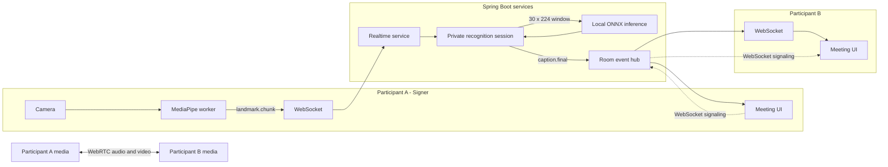
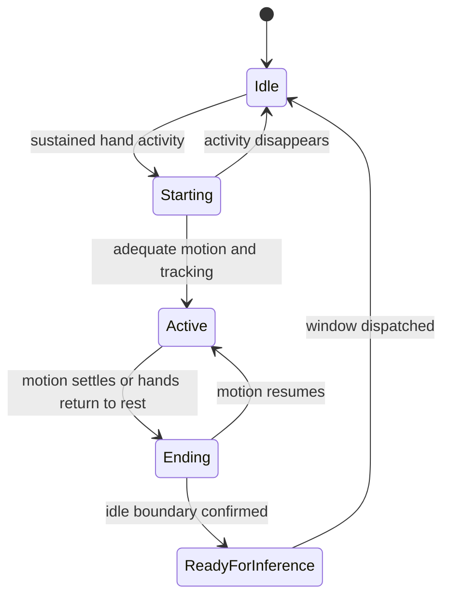

# SignConnect Product and Implementation Roadmap

> Status: Active
> Last updated: 2026-08-29
> Product focus: Desktop-first, two-person sign-supported meetings
> Inference strategy: Local MediaPipe capture with Spring Boot and ONNX Runtime Java

## Purpose

This document turns the current SignConnect prototype into a sequence of independently demonstrable milestones. Each milestone has a clear objective, implementation scope, acceptance gate, and explicit exclusions so it can be completed without accidentally expanding into continuous sign-language translation or production-scale conferencing too early.

The immediate product goal is:

> Participant A creates a room, Participant B joins it, Participant A enables recognition and performs a supported sign, and one finalized caption appears exactly once in both browsers through the room WebSocket.

The next major demonstration after that is:

> Two people join from separate devices, see and hear each other through WebRTC, and a genuine supported sign performed by one participant appears as a shared caption.

## How to use this roadmap

Implement the milestones in order. A milestone is complete only when its acceptance gate passes.

For each milestone:

1. Create the recommended branch from an up-to-date `main`.
2. Confirm the prerequisite milestones are complete.
3. Implement only the in-scope work.
4. Run the focused automated checks and manual demonstration.
5. Record important decisions in the implementation notes.
6. Merge only after the acceptance gate passes.

Progress legend:

- `[ ]` Not started
- `[-]` In progress
- `[x]` Complete

## Current baseline

SignConnect already contains a meaningful recognition pipeline:

- MediaPipe hand and upper-body landmark extraction runs in a browser worker.
- Capture targets approximately 25 processed frames per second.
- Accepted frames are sent in five-frame `landmark.chunk` messages.
- The realtime service owns a rolling 30-frame window with shape `[1, 30, 224]`.
- Spring Boot calls the inference service over HTTP.
- ONNX Runtime Java executes the configured model locally.
- The realtime service handles stability, idle separation, unknown results, duplicate suppression, backpressure, timeouts, and reconnect resets.
- The meeting frontend owns a single reconnecting WebSocket client per meeting.

The two important prototype limitations are:

1. The current ONNX model is intentionally synthetic and cannot be presented as validated sign-language recognition.
2. Recognition results return only to the WebSocket connection that submitted the landmark data. There is no shared participant room yet.

Relevant implementation references:

- [`docs/adr/0001-mock-first-sign-recognition.md`](adr/0001-mock-first-sign-recognition.md)
- [`docs/privacy/sign-recognition-data-boundary.md`](privacy/sign-recognition-data-boundary.md)
- `backend/realtime-service`
- `backend/sign-inference-service`
- `backend/meeting-service`
- `frontend/apps/meeting/src/recognition`
- `config/vocabulary/sign-v1-candidates.json`

## Product scope

### First real product slice

- Desktop-first experience.
- One host and one guest.
- One active signer at a time.
- Ephemeral meeting rooms.
- Shared finalized captions.
- Small, explicitly supported isolated-sign vocabulary.
- Local landmark extraction.
- Local ONNX inference service.
- One-to-one WebRTC audio and video after the shared-caption milestone.

### Not the initial product scope

- Continuous sentence translation.
- Large or open-ended vocabulary.
- Multiple simultaneous signers.
- Multi-party video conferencing.
- Automatic learning from user corrections.
- Storing raw camera recordings.
- Mobile-specific layouts.
- Kubernetes or premature distributed infrastructure.

## Privacy boundary

Camera pixels stay in the browser recognition pipeline. Derived landmark data is sent only to the signer's private recognition session and is handled transiently. It is not persisted, logged, or broadcast to other room participants. Only finalized captions, participant state, and call-signaling events are shared through the room event layer. WebRTC carries encrypted peer media separately from the recognition service.

## Target user experience

1. The host creates a SignConnect room.
2. SignConnect generates a shareable link and short join code.
3. A guest opens the link and enters a display name.
4. Both participants see the room and participant presence.
5. The signer enables their camera and recognition.
6. SignConnect reports whether the upper body and hands are adequately tracked.
7. The signer performs a supported sign.
8. The browser extracts and normalizes landmarks.
9. The realtime and inference services recognize and stabilize the sign.
10. The same finalized caption appears for both participants.
11. Once WebRTC is added, both participants can also see and hear each other.

## Target architecture



## Milestone summary

| Milestone | Outcome | Recommended branch | Depends on |
|---|---|---|---|
| 1. Realtime room foundation | Two browsers share presence and finalized captions | `codex/realtime-room-mvp` | Current baseline |
| 2. Reliable room behavior | Reconnect, ordering, isolation, and active-signer ownership | Continue Milestone 1 branch or `codex/realtime-room-reliability` | Milestone 1 |
| 3. Gesture capture and segmentation | Clear camera guidance and cleaner gesture windows | `codex/gesture-segmentation` | Milestone 2 |
| 4. Real small-vocabulary model | Genuine 5-sign ONNX proof | `codex/sign-model-v1` | Milestone 3 |
| 5. Qualified supported vocabulary | Signer-independent 10-20 sign candidate | `codex/sign-model-qualification` | Milestone 4 |
| 6. One-to-one video calling | Two devices communicate through WebRTC with shared captions | `codex/webrtc-one-to-one` | Milestone 2; preferably Milestone 4 |
| 7. Deployable application foundation | Secure, persistent, observable staging application | `codex/production-foundation` | Milestones 1-6 |

---

# Milestone 1: Realtime room foundation

## Status

- [x] Complete

## Objective

Convert the current same-client WebSocket path into a room-based system where multiple participants can join a meeting and receive the same public events while recognition input remains private to the submitting connection.

## User outcome

The host creates a room, a guest joins it, both see participant presence, and both receive one identical finalized caption when the host-side recognition fixture completes.

## Backend scope

### Room registry

Introduce a room registry interface in the realtime service.

The first implementation should be in memory:

```text
meetingId
  +-- participant A connection
  +-- participant B connection
  +-- participant C connection
```

Each connection continues to own a private `RealtimeRecognitionSession`. The registry is responsible for public room membership and outbound public events, not inference state.

Suggested responsibilities:

- Register an authenticated connection.
- Remove a disconnected connection.
- Return a room membership snapshot.
- Broadcast allowed public events.
- Prevent cross-room delivery.
- Enforce a small room capacity.
- Track the active signer.

Suggested types:

- `RoomRegistry`
- `InMemoryRoomRegistry`
- `RoomConnection`
- `RoomParticipant`
- `RoomSnapshot`
- `RoomEventPublisher`

### Public and private event separation

Private connection input:

```text
landmark.chunk -> recognition session -> inference
```

Public room output:

```text
caption.final -> all room participants
participant.joined -> all room participants
participant.left -> all room participants
```

`recognition.unknown` should initially return only to the signer because it is interaction feedback rather than transcript content.

## Meeting service scope

The current meeting service creates meetings but does not provide a participant lifecycle. Add the smallest useful lifecycle:

```text
POST /api/v1/meetings
POST /api/v1/meetings/{joinCode}/participants
GET  /api/v1/meetings/{meetingId}
POST /api/v1/meetings/{meetingId}/leave
```

The participant join response should contain:

- `meetingId`
- `participantId`
- `displayName`
- `role`
- `realtimeTicket`
- `expiresAt`

For the first implementation, meetings and participant tickets can be ephemeral and in memory.

## WebSocket contract

Recommended client events:

- `room.join`
- `room.leave`
- `participant.heartbeat`
- Existing `recognition.control`
- Existing `landmark.chunk`

Recommended server events:

- `room.joined`
- `room.snapshot`
- `participant.joined`
- `participant.left`
- `participant.updated`
- Existing `caption.final`
- Existing `recognition.unknown`
- Existing recognition status events

The connection should remain untrusted until a valid `room.join` message supplies the short-lived realtime ticket. Reject other application messages until joining succeeds.

Recommended shared event envelope:

```json
{
  "schemaVersion": 1,
  "type": "caption.final",
  "meetingId": "meeting-id",
  "participantId": "source-participant-id",
  "sequence": 42,
  "occurredAt": "2026-08-29T12:00:00Z",
  "payload": {}
}
```

Add the following caption fields:

- `captionId`
- `sourceParticipantId`
- `sourceDisplayName`
- `streamId`
- `labelId`
- `text`
- `confidence`
- `modelVersion`
- `mockModel`
- `inferenceLatencyMs`

Use `captionId` as the stable idempotency key across reconnects.

## Frontend scope

- Create-room screen.
- Join-room screen.
- Display-name entry.
- Copyable invitation link.
- Short join-code display.
- Participant list.
- Connection status.
- Active-signer indicator.
- Caption source name.
- Clear failure state for invalid or expired rooms.

The first proof can use two browser windows. It does not require user accounts, persistence, or WebRTC.

## Implementation checklist

- [x] Define versioned room event types in frontend and backend.
- [x] Create meeting participant and realtime-ticket models.
- [x] Add the meeting join endpoint.
- [x] Add the room registry interface.
- [x] Implement the in-memory room registry.
- [x] Authenticate the initial `room.join` event.
- [x] Create and broadcast room snapshots.
- [x] Broadcast participant join and leave events.
- [x] Attach source participant metadata to `caption.final`.
- [x] Broadcast finalized captions to the room.
- [x] Keep unknown recognition feedback private to the signer.
- [x] Add create/join frontend routes or views.
- [x] Add the invitation and participant UI.
- [x] Demonstrate with two browser windows.

## Acceptance gate

- [x] Two browser windows can join the same meeting.
- [x] Both receive participant presence updates.
- [x] A fixture or recognized sign from participant A creates one caption.
- [x] The caption appears exactly once in both browsers.
- [x] Participant B never receives A's landmark chunks.
- [x] Another meeting cannot receive the caption.
- [x] Disconnecting a browser removes its presence.
- [x] The current synthetic model remains clearly identified as a demo model.

## Explicitly out of scope

- WebRTC audio or video.
- Redis.
- Database persistence.
- User accounts.
- Multiple active signers.
- Caption history replay.

---

# Milestone 2: Reliable room behavior

## Status

- [ ] Not started

## Objective

Make the two-browser room demonstration deterministic under reconnects, message duplication, failures, and participant changes.

## Room ordering

Use two independent ordering concepts:

- A private stream sequence for signer landmark and inference ordering.
- A public room sequence for room events and captions.

Recommended caption idempotency components:

```text
meetingId + sourceParticipantId + streamId + captionSequence
```

The client transcript should ignore a caption whose `captionId` is already present.

## Active signer ownership

Support one active signer at a time.

Suggested behavior:

1. A participant enables recognition.
2. The server grants or denies the active-signer role.
3. Other participants can still use their camera for the call later, but cannot upload recognition landmarks.
4. The role is released when recognition stops, the signer leaves, or the connection expires.

Recommended events:

- `signer.request`
- `signer.granted`
- `signer.denied`
- `signer.released`
- `participant.updated`

## Reconnect behavior

- Preserve the participant identity with a short-lived resume token.
- Generate a new recognition `streamId` after reconnect.
- Reset the private recognition window and stabilizer.
- Discard late inference results from the old connection.
- Return a fresh room snapshot.
- Do not replay old captions in this milestone.
- Do not duplicate an already-rendered caption.

## Backpressure classes

Treat event categories differently:

- Landmark chunks: latest-complete-window behavior; older pending data may be replaced.
- Control and signer-ownership events: ordered and never silently dropped.
- Final captions: ordered, idempotent, and never replaced by a newer caption.
- Presence: snapshots may supersede older transient presence updates.

## Failure states

The frontend should distinguish:

- Room disconnected.
- Reconnecting.
- Room no longer exists.
- Realtime ticket expired.
- Signer role unavailable.
- Recognition service unavailable.
- Inference timed out.
- Camera tracking lost.

## Focused automated checks

1. A final caption reaches both participants exactly once.
2. A caption never leaks into another meeting.
3. Landmark chunks are never broadcast to another participant.
4. Disconnecting removes the participant and private recognition session.
5. Reconnect cannot finalize a stale inference response.

## Implementation checklist

- [ ] Add room event sequence numbers.
- [ ] Add stable caption identifiers.
- [ ] Make transcript insertion idempotent.
- [ ] Add active-signer ownership.
- [ ] Add resume-ticket behavior.
- [ ] Reset recognition streams on reconnect.
- [ ] Discard stale inference responses.
- [ ] Add room and recognition failure states.
- [ ] Add the five focused integration checks.
- [ ] Run a two-browser disconnect and reconnect demonstration.

## Acceptance gate

- [ ] Two participants maintain a consistent ordered transcript.
- [ ] Reconnect does not duplicate the last caption.
- [ ] Old inference work cannot appear after reconnect.
- [ ] Only the granted signer can upload landmark chunks.
- [ ] Cross-room isolation checks pass.
- [ ] Recognition failure does not terminate the meeting room.

---

# Milestone 3: Gesture capture and segmentation

## Status

- [ ] Not started

## Objective

Make camera recognition understandable to the user and produce cleaner temporal samples for a real model.

## Tracking feedback

Support clear camera states:

- Camera off.
- Camera initializing.
- No person detected.
- Upper body not fully visible.
- Left hand missing.
- Right hand missing.
- Hands too close to the frame edge.
- Lighting or tracking quality too poor.
- Ready to sign.
- Gesture in progress.
- Processing.
- Sign recognized.
- Sign not recognized.

## Optional tracking overlay

Add a toggleable overlay with:

- Left and right hand skeletons.
- Upper-body anchor points.
- Safe signing area.
- Frame-edge warnings.
- Gesture activity indicator.

The overlay should help with setup but remain optional during a conversation.

## Session calibration

After camera startup:

1. Ask the user to sit or stand naturally.
2. Confirm shoulders and both hands are visible.
3. Measure approximate shoulder scale.
4. Confirm camera orientation and mirroring.
5. Keep calibration data only for the active session.

## Gesture boundary state machine



Potential segmentation signals:

- Hand and wrist velocity.
- Finger landmark movement.
- Distance between hands.
- Pose stability.
- Visible-landmark count.
- Consecutive idle frames.
- Frame timestamps and dropped-frame gaps.

The inference tensor can remain `[1, 30, 224]`. Crop, resample, or pad the detected gesture interval into 30 frames.

## Handedness and fixture coverage

Preserve the existing MediaPipe handedness correction and validate it with recorded landmark fixtures covering:

- Left-handed signing.
- Right-handed signing.
- Mirrored preview.
- One-hand signs.
- Two-hand signs.
- Temporary occlusion.
- Different camera distances.
- Faster and slower performance.

## Implementation checklist

- [ ] Define the camera-quality model.
- [ ] Calculate frame-edge and visibility quality.
- [ ] Add the optional landmark overlay.
- [ ] Add the signing-area guide.
- [ ] Add session calibration.
- [ ] Implement local activity detection.
- [ ] Implement gesture start/end hysteresis.
- [ ] Resample bounded gestures into the model input window.
- [ ] Preserve missing-landmark masks.
- [ ] Create a small recorded fixture collection.
- [ ] Add actionable unknown-sign feedback.

## Acceptance gate

- [ ] The interface explains why recognition is unavailable.
- [ ] Users can position themselves without guessing.
- [ ] Camera adjustment does not begin a sign accidentally.
- [ ] Held signs do not repeatedly emit captions.
- [ ] Returning to idle separates genuine repeated signs.
- [ ] Recorded fixtures normalize consistently across distance and speed.

---

# Milestone 4: Real small-vocabulary model

## Status

- [ ] Not started

## Objective

Replace the deterministic synthetic model with a genuine five-sign isolated-sign proof while retaining the mock model as an explicit development fixture.

## Product language

Describe this feature as **supported-sign recognition**. Do not describe it as full sign-language translation.

## Vocabulary selection

Start with five distinct, high-value meeting intents. Candidate English captions include:

- Hello.
- Thank you.
- Yes.
- No.
- Help.
- Repeat.
- Slower.
- Understand.
- Finished.
- Goodbye.

Select the final five only after an SGSL signer or linguistic reviewer confirms that each caption intent maps cleanly to an isolated supported sign and is visually distinguishable within the capture boundary.

## Internal dataset capture tool

Build a development-only capture route that allows an authorized tester to:

- Select a vocabulary label.
- View instructions or reference media.
- Record several repetitions.
- Inspect tracking quality.
- Accept or discard a take.
- Assign an anonymized signer ID.
- Record handedness and capture conditions.
- Export normalized landmark sequences.

## Pipeline-proof dataset

Recommended first proof:

- Five signs.
- Three to five signers.
- Twenty to thirty repetitions per sign.
- Explicit `NO_SIGN` examples.
- Natural hand movement and transition examples.

This dataset proves the technical pipeline only. It is not sufficient for robust signer-independent quality claims.

## Model recommendation

Use a small Temporal Convolutional Network as the first candidate because it is efficient on CPU, straightforward to export to ONNX, and well matched to short landmark sequences.

Compare it against a small GRU baseline. Avoid starting with a Transformer unless the simpler models fail for an identified reason.

The model contract should include:

- Input shape `[1, 30, 224]` or an explicitly versioned replacement.
- Missing-landmark and visibility information.
- Temporal motion information where useful.
- A `NO_SIGN` class.
- Unknown/rejection behavior.
- Calibrated confidence.
- Versioned label map.
- `mockModel: false` metadata.

## Training and export pipeline

- Split data by signer, not random recording.
- Train and evaluate in Python.
- Export the selected model to ONNX.
- Verify Python and ONNX output parity.
- Validate the model and label map at service startup.
- Keep model selection configuration explicit.
- Never silently fall back from a missing real model to mock behavior.

## Implementation checklist

- [ ] Confirm five initial signs with an SGSL reviewer.
- [ ] Add the development-only capture route.
- [ ] Define the dataset manifest format.
- [ ] Capture `NO_SIGN` and transition movement.
- [ ] Collect the pipeline-proof dataset.
- [ ] Build the TCN baseline.
- [ ] Build the GRU comparison baseline.
- [ ] Evaluate by held-out signer.
- [ ] Export the selected model to ONNX.
- [ ] Verify Python/ONNX parity.
- [ ] Add real model metadata and label map.
- [ ] Load the model through the existing Java runtime.
- [ ] Add an explicit mock/real development configuration.
- [ ] Demonstrate an actual supported sign in the browser.

## Acceptance gate

- [ ] At least five reviewed signs traverse the full browser-to-caption path.
- [ ] An unseen recording fixture produces the expected label.
- [ ] `NO_SIGN` prevents obvious idle false positives.
- [ ] Python and ONNX outputs agree within the defined tolerance.
- [ ] Inference remains below the existing 500 ms timeout.
- [ ] The UI clearly distinguishes real and mock model modes.
- [ ] The system makes no unsupported full-translation claim.

---

# Milestone 5: Qualified supported vocabulary

## Status

- [ ] Not started

## Objective

Expand the pipeline proof into a small signer-independent model candidate that can credibly support a limited product demonstration.

## Dataset expansion

Target:

- Ten to twenty supported signs.
- Ten to twenty diverse signers.
- Different camera distances.
- Different signing speeds.
- Different backgrounds and lighting.
- Left- and right-handed signers where applicable.
- Natural idle and transition movements.

All training, validation, and final testing partitions must be separated by signer.

## Evaluation

Measure:

- Per-class precision.
- Per-class recall.
- Per-class F1.
- Macro F1.
- Confusion matrix.
- Idle false-positive rate.
- Unknown-sign rejection behavior.
- Model inference latency.
- End-to-end caption latency.

Suggested candidate gates:

- Signer-independent macro F1 at or above 0.80.
- No individual supported sign with catastrophically low recall.
- Very low false positives during natural idle movement.
- ONNX inference comfortably below 500 ms.
- Caption finalization approximately 1 to 1.5 seconds after the sign finishes under normal local conditions.

If the model misses the gate, reduce or revise the vocabulary before adding more signs.

## Recognition experience

Add:

- Supported-vocabulary panel.
- Reference demonstrations.
- Experimental-status labeling.
- Signer name on captions.
- Timestamp.
- Subtle confidence display.
- Clear transcript action.
- Copy transcript action.
- Optional caption correction.
- Helpful retry guidance for unknown signs.

Only `caption.final` should enter the shared transcript. Temporary recognition feedback may remain local to the signer.

## Implementation checklist

- [ ] Confirm the expanded vocabulary with an SGSL reviewer.
- [ ] Expand signer and environment diversity.
- [ ] Freeze a signer-independent final test set.
- [ ] Generate per-class evaluation reports.
- [ ] Tune confidence and rejection thresholds.
- [ ] Tune segmentation and idle separation.
- [ ] Revise confusing vocabulary items.
- [ ] Add the supported-vocabulary UI.
- [ ] Add reference demonstrations.
- [ ] Add transcript utility actions.
- [ ] Run a two-participant real-sign demonstration.

## Acceptance gate

- [ ] The agreed signer-independent quality gate passes.
- [ ] Final captions remain stable and ordered for both participants.
- [ ] Held signs do not generate repeated captions.
- [ ] A genuine repeat after idle is recognized.
- [ ] Unknown signs produce useful signer feedback.
- [ ] Both participants see the same transcript.
- [ ] Model failure does not break room communication.

---

# Milestone 6: One-to-one WebRTC calling

## Status

- [ ] Not started

## Objective

Allow two participants to see and hear each other while the local signer camera simultaneously feeds the recognition pipeline.

## Technology responsibilities

| Technology | Responsibility |
|---|---|
| WebSocket | Presence, room events, captions, and call signaling |
| WebRTC | Audio and video media |
| HTTP | Meeting creation, participant joining, and model inference |
| MediaPipe | Browser-local landmark extraction |

## Signaling events

Add room-scoped events:

- `call.offer`
- `call.answer`
- `call.ice-candidate`
- `call.decline`
- `call.leave`
- `media.state`

Signaling payloads must be routed only to the intended participant in the same meeting.

## Media behavior

- Reuse the existing local camera `MediaStream` for recognition.
- Do not request or open the same camera twice.
- Provide camera on/off.
- Provide microphone mute/unmute.
- Provide audio and video device selection.
- Show the local preview.
- Show the remote participant video.
- Show call connection and recovery states.
- Handle permission denial clearly.
- Stop media tracks when leaving.

## Network infrastructure

A local proof can begin with STUN. A deployed application requires TURN for networks where direct peer connectivity fails.

Keep the first version one-to-one and peer-to-peer. If multi-party meetings become necessary, evaluate an SFU such as LiveKit, mediasoup, or Janus rather than building a browser mesh.

## Implementation checklist

- [ ] Define versioned call-signaling events.
- [ ] Route signaling to the intended room participant.
- [ ] Create the peer-connection lifecycle.
- [ ] Exchange offers, answers, and ICE candidates.
- [ ] Reuse the recognition camera stream.
- [ ] Add local and remote video surfaces.
- [ ] Add microphone and camera controls.
- [ ] Add device selection.
- [ ] Add call failure and reconnect states.
- [ ] Configure STUN for development.
- [ ] Configure TURN for staging.
- [ ] Test on two separate devices.
- [ ] Test a network path that requires TURN.

## Acceptance gate

- [ ] Two devices join through the same invitation link.
- [ ] Both participants see and hear one another.
- [ ] The signer's camera simultaneously feeds MediaPipe.
- [ ] A recognized caption appears for both participants.
- [ ] Camera and microphone state remains synchronized.
- [ ] Leaving releases media devices.
- [ ] TURN fallback works when a direct connection cannot be established.

## Explicitly out of scope

- Group calling.
- Screen sharing.
- Recording.
- Server-side media processing.
- Background effects.

---

# Milestone 7: Deployable application foundation

## Status

- [ ] Not started

## Objective

Move the working two-person product slice into a secure, persistent, observable staging application.

## Identity and authorization

- User accounts or durable guest identities.
- Host, signer, and viewer roles.
- Expiring invitation links.
- Short-lived realtime tickets.
- Authorized meeting access.
- Room capacity limits.
- Request and event rate limits.
- Restricted WebSocket origins.

## Persistence

Use a relational database for:

- Meetings.
- Participants.
- Meeting lifecycle.
- Invitations.
- Model versions.
- Optional caption transcript metadata.

Caption persistence should be opt-in and governed by an explicit retention policy.

## Realtime scaling

Keep room membership behind the `RoomRegistry` interface from Milestone 1.

Start with:

```text
InMemoryRoomRegistry
```

Introduce later when multiple realtime-service instances are required:

```text
RedisRoomRegistry
Redis Pub/Sub or Streams
```

Redis is not required for the initial two-person proof.

## Operations

- TLS and secure WebSockets.
- Health and readiness endpoints.
- Inference model readiness.
- Connection metrics.
- Caption latency metrics.
- Inference latency metrics.
- Metadata-only structured logging.
- Docker deployment.
- Environment-specific configuration.
- Staging deployment.
- Backup and retention policy.
- Clear degraded UI when inference is unavailable.

## Implementation checklist

- [ ] Select the account or guest identity model.
- [ ] Add persistent meeting storage.
- [ ] Add persistent participant and invitation storage.
- [ ] Enforce room authorization.
- [ ] Add rate limiting.
- [ ] Restrict WebSocket origins.
- [ ] Configure TLS and secure WebSockets.
- [ ] Add model and service readiness checks.
- [ ] Add metadata-only operational metrics.
- [ ] Add Docker deployment definitions.
- [ ] Deploy a staging environment.
- [ ] Document data retention and deletion.
- [ ] Run a two-device staging demonstration.

## Acceptance gate

- [ ] An authorized user or guest can create and join a staged meeting.
- [ ] Invitation and realtime tickets expire correctly.
- [ ] Unauthorized room access is rejected.
- [ ] Two devices complete a call and shared-caption demonstration on staging.
- [ ] Recognition failure degrades gracefully.
- [ ] Operational dashboards expose connection, inference, and caption latency without sensitive payloads.

---

# Focused test strategy

Comprehensive testing is not required during the early visual and functional proof. Prioritize a small set of checks that protect architectural boundaries and make demonstrations repeatable.

## Realtime integration

- Same caption reaches two participants exactly once.
- Captions remain isolated to their meeting.
- Landmark chunks remain private to the source recognition session.
- Disconnect cleans up participant and inference state.
- Reconnect discards stale recognition work.

## Gesture fixtures

- Correct handedness under mirrored preview.
- Consistent normalization at different distances.
- One-hand and two-hand samples.
- Occlusion and tracking-loss behavior.
- Idle separation and genuine repeated signs.

## Model checks

- Dataset split is signer-independent.
- Python and ONNX output parity.
- Label-map and tensor-shape validation.
- Per-class metrics and confusion matrix.
- Idle false-positive measurement.

## Manual product demonstrations

- Two browser windows in the same room.
- Two separate devices on the same network.
- Two devices on different networks.
- Camera and microphone permission denial.
- Realtime and inference service interruption.
- TURN-required WebRTC connection.

# Key risks and responses

## Linguistic correctness

Risk: English caption concepts may be incorrectly mapped to SGSL or may require non-manual features outside the current capture scope.

Response: Require vocabulary review by an SGSL signer or expert before collecting labeled data or making product claims.

## False positives and gesture boundaries

Risk: Natural movement may be classified as a sign, or a held sign may produce duplicate captions.

Response: Prioritize `NO_SIGN`, transition examples, motion segmentation, idle separation, and confidence calibration before expanding vocabulary.

## Signer overfitting

Risk: The model works for people whose recordings appeared in training but fails for new users.

Response: Split all data by signer and keep an untouched signer-independent test set.

## Realtime leakage

Risk: A room-routing error exposes a caption or sensitive recognition payload to the wrong participant or meeting.

Response: Separate private recognition sessions from the public room publisher and test cross-room isolation directly.

## WebRTC connectivity

Risk: Calls work locally but fail across restrictive networks.

Response: Add TURN before calling the video feature staging-ready.

## Premature infrastructure complexity

Risk: Redis, distributed deployments, or multi-party media slow down validation of the core interaction.

Response: Begin with in-memory rooms and one-to-one calls while keeping clean interfaces for later scaling.

# Overall definition of done

SignConnect reaches its initial application milestone when:

- A host creates a meeting and shares an invitation.
- A guest joins from a second device.
- Both participants see presence and connection status.
- They establish a one-to-one audio/video call.
- One participant enables supported-sign recognition.
- The camera UI confirms adequate tracking.
- A genuine supported sign is recognized by a non-mock ONNX model.
- One stable caption appears exactly once for both participants.
- Unknown signs and service failures produce useful feedback.
- The application is deployed securely to staging.

# Future research milestone: Continuous signing

Continuous sign-language translation should be treated as a separate research program rather than a small extension of isolated-sign classification.

It would require:

- Continuous gesture segmentation.
- Much larger and linguistically reviewed datasets.
- Facial expression and other non-manual features.
- Gloss or sequence modeling.
- Sentence-level translation and language modeling.
- Evaluation by fluent signers.
- Substantially broader privacy and consent design.

Do not schedule this work until the small supported-sign product slice is reliable with unseen signers.

# Implementation notes and decision log

Use this section to record decisions while working through the roadmap.

| Date | Milestone | Decision | Reason |
|---|---|---|---|
| 2026-08-29 | Planning | Build shared-caption rooms before WebRTC | Proves multi-user routing independently from media complexity |
| 2026-08-29 | Planning | Begin with one active signer | Avoids ambiguous caption ordering and multiple inference streams |
| 2026-08-29 | Planning | Keep the first room registry in memory | Fastest path to a two-browser proof; interface permits later Redis implementation |
| 2026-08-29 | Planning | Treat continuous signing as future research | Current capture and data strategy targets isolated supported signs |
| 2026-08-29 | Milestone 1 | Authenticate realtime sockets with short-lived HMAC tickets | Keeps the WebSocket untrusted until meeting identity and role are verified |
| 2026-08-29 | Milestone 1 | Broadcast only presence and finalized captions | Preserves private landmark, recognition-status, and unknown-result boundaries |
| 2026-08-29 | Milestone 1 | Defer active-signer arbitration to Milestone 2 | Room membership and shared-caption delivery are independently demonstrable first |

## Per-milestone completion record

Copy this template when completing a milestone:

```markdown
### Milestone N completion

- Branch:
- Pull request or commit:
- Completion date:
- Demonstration performed:
- Automated checks run:
- Known limitations:
- Follow-up work:
- Acceptance gate: PASS / FAIL
```

### Milestone 1 completion

- Branch: `codex/realtime-room-mvp`
- Pull request or commit: Pending
- Completion date: 2026-08-29
- Demonstration performed: Two isolated browser sessions created and joined one room, received the same source-attributed synthetic caption exactly once, and reflected guest disconnect immediately.
- Automated checks run: Meeting, ticket, realtime, room-isolation, landmark-privacy, inference, frontend contract/component, TypeScript, and production-build checks.
- Known limitations: Ephemeral in-memory rooms, development shared secret, no active-signer arbitration, no WebRTC, and a clearly labeled synthetic recognition model.
- Follow-up work: Milestone 2 reliability, ordering, reconnect idempotency, and signer ownership.
- Acceptance gate: PASS
